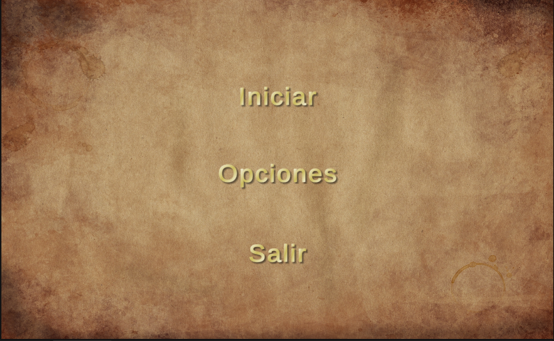

## TanksMenu

Se ha diseñado un menu sencillo que tiene las siguientes características:
 - Diseño comnpatible con el juego
 - Posicion de botones estándar
 - Uso del total de la pantalla.

Se ha usado texto para los botones de los menús e iconos para el botón de pausa ya que está en la pantalla de juego y conviene usar el menor espacio posible.

Se ha usado un color más oscuro para la selección actual del botón con el objetivo de dar un poco de feedback al usuario, sobretodo cuando se usa un controlador y no teclado y ratón

